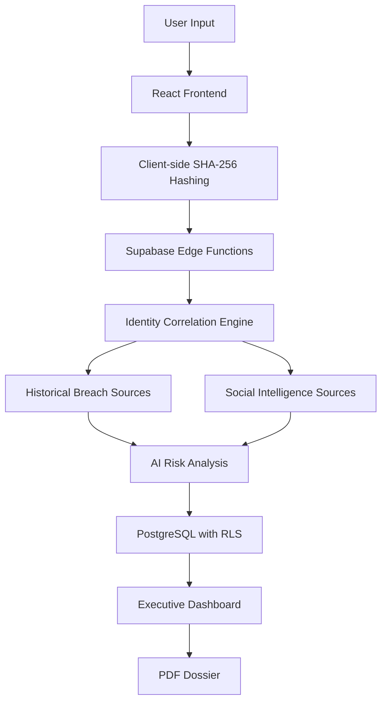

# Technical Architecture Blueprint: E-VARA

E-VARA is engineered for high availability, security, and scalability. This document outlines the system architecture and technical decisions that underpin the platform.

## 1. Core Philosophy

The platform operates on a "Privacy-First Intelligence" model. Using privacy-preserving ingestion, all sensitive identifiers are hashed client-side before being processed by the intelligence engine. This limits raw data collection while maintaining powerful correlation capabilities.

## 2. Technology Stack

- **Frontend Core**: React 18 with TypeScript for type-safe UI development.
- **Build Tooling**: Vite for lightning-fast development and optimized production builds.
- **Styling**: Tailwind CSS v3 with a custom HUD design system.
- **Backend-as-a-Service**: Supabase (PostgreSQL, Auth, Edge Functions, Storage).
- **State Management**: TanStack Query (React Query) for efficient server-state synchronization.
- **Visualization**: Recharts for data analytics and Framer Motion for high-end UI animations.

## 3. Data Flow & Security

## Identity Analysis Pipeline

The Identity Analysis Pipeline describes how user-provided identity markers are securely processed through E-VARA's architecture.

### Pipeline Overview

This pipeline illustrates how identity markers are securely processed from client input through backend analysis and executive reporting.

### Step 1: Client Input

Users provide one or more identity markers such as:

- Email addresses
- Usernames
- Full names

The frontend validates input before processing.

### Step 2: Privacy-Preserving Processing

Sensitive identifiers are hashed client-side using the Web Crypto API and SHA-256 before transmission.

This approach minimizes raw identifier exposure while preserving correlation capabilities.

### Step 3: Secure Backend Processing

Hashed identifiers are securely transmitted to Supabase Edge Functions over TLS.

Edge Functions coordinate identity analysis and backend workflows.

### Step 4: Identity Correlation

The Identity Correlation Engine combines information from multiple intelligence sources, including:

- Historical breach datasets
- Social identity signals
- Publicly available metadata

The objective is to build a privacy-conscious identity profile for analysis.

### Step 5: AI Risk Analysis

Correlated signals are processed by the AI analysis layer.

The AI component:

- Evaluates exposure patterns.
- Identifies potential threat vectors.
- Estimates relative risk.
- Generates explainable findings.

### Step 6: Persistence Layer

Analysis results are stored in PostgreSQL.

Supabase Row Level Security (RLS) ensures users can only access their own records.

### Step 7: Presentation Layer

Processed intelligence is surfaced through:

- Executive dashboards.
- Threat visualizations.
- Identity monitoring summaries.
- Executive PDF dossiers.

### Security Principles

The Identity Analysis Pipeline follows several core principles:

- Privacy-first data handling.
- Client-side hashing.
- Secure TLS communication.
- Row Level Security enforcement.
- Serverless backend scaling.
- Explainable AI-assisted analysis.

### Threat Surface Mapping

Threat Surface Mapping extends the Identity Analysis Pipeline by transforming correlated identity signals into actionable security intelligence.

#### Vector Analysis

The outputs generated during **Step 4: Correlation** are evaluated to identify potential threat vectors and attack paths.

This process includes:

- Correlating identity markers across multiple intelligence sources.
- Identifying relationships between exposure events.
- Estimating relative risk based on available evidence.
- Building a higher-level view of an individual's digital exposure surface.

The objective is to provide explainable security insights while maintaining E-VARA's privacy-first approach.

#### Auditing and Executive Reporting

The findings generated throughout the pipeline are incorporated into **Step 7: Presentation Layer** to produce traceable security artifacts.

This includes:

- Executive dashboards.
- Identity monitoring summaries.
- Historical exposure tracking.
- Professional PDF dossiers generated using `jsPDF`.

These reports help users understand what changed, why it matters, and what actions may be appropriate for improving their digital security posture.

## 4. Scalability

- **Serverless Compute**: Deno-based Edge Functions scale with demand, offering predictable infrastructure scaling.
- **Database Indexing**: Optimized PostgreSQL indexes on identity hashes for fast lookup times.
- **Asset Delivery**: Static assets served via global CDN for low latency.

## 5. Deployment Strategy

- **Environment Parity**: Strict adherence to `.env` configuration for dev, staging, and production.
- **CI/CD**: Recommended GitHub Actions pipeline for automated linting, testing, and deployment.

---

_E-VARA: Engineered for the next generation of digital defense._
