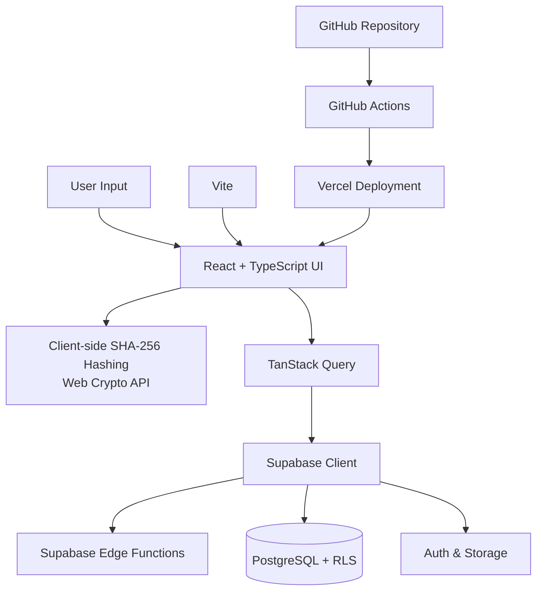

# E-VARA: Executive Identity Intelligence Platform

[]()
[]()
[]()

E-VARA is a privacy-first identity intelligence platform engineered for real-time identity monitoring, threat surface analysis, and executive digital protection. Built for executives, founders, operators, and public-facing teams, E-VARA helps users understand what changed, what matters, and what action to take next.

<div align="center">
  
</div>
<br/>

## 💎 Value Proposition: The Executive Defense Layer
E-VARA combines exposure monitoring, trust scoring, explainable risk analysis, and executive reporting into a single operating layer. The goal isn’t surveillance. The goal is helping users understand trust instead of collecting everything.
- **Exposure Intelligence**: Privacy-preserving ingestion that monitors exposure signals using cryptographic hashing at the edge, strictly minimizing storage of raw identifiers.
- **Explainable Risk**: Automated monitoring that surfaces risk and translates technical findings into understandable security decisions with a localized, dynamic risk score.
- **Executive Reporting & Protection**: Institutional-grade PDF dossiers ready for C-suite review, accompanied by stateless rate-limiting to prevent enumeration attacks.
- **Architectural Excellence**: Built with a production-oriented asynchronous edge worker architecture (React, TypeScript, Supabase, Tailwind CSS).
- **Compliance Ready**: Designed with industry-standard cryptographic protections and SHA-256 client-side hashing protocols.

## 🚀 Key Features
- **Advanced Identity Correlation Engine**: Maps identity markers across 5+ major social networks and the deep web.
- **Executive Threat Auditing**: Generates multi-page, professional-grade "Identity Dossiers" for executive security audits.
- **Validated Threat Intelligence Integration**: Real, configurable deep-web integrations with industry standards like HaveIBeenPwned (HIBP) and DeHashed via asynchronous Supabase Edge Workers.
- **Real-time Threat Visualization**: Interactive HUD-style dashboard with attack vector simulations.
- **SaaS Infrastructure**: Integrated multi-tier pricing, billing entry points, and robust user management.

<div align="center">
  
  
</div>
<div align="center">
  
</div>
<br/>

## 🛠 Technical Architecture

E-VARA utilizes a cutting-edge serverless architecture for maximum scalability and performance.



- **Frontend**: React 18 (TypeScript), Vite, Tailwind CSS, Framer Motion.
- **Infrastructure**: Supabase (PostgreSQL, Auth, Edge Functions, RLS).
- **Visualization**: Custom HUD components, Recharts, Lucide Icons.
- **Data Integrity**: Web Crypto API for client-side privacy-preserving hashing.

## 📦 Getting Started

### Prerequisites
- Node.js 20+
- Supabase Account

### Environment Configuration
```env
VITE_SUPABASE_URL=your_instance_url
VITE_SUPABASE_ANON_KEY=your_anon_key
```

### Deployment
1. **Database Setup**: Execute `schema.sql` in the Supabase SQL Editor.
2. **Edge Functions**: Deploy monitoring functions:
   ```bash
   supabase functions deploy breach-check
   ```
3. **Frontend**:
   ```bash
   npm install
   npm run build
   ```

## 📈 Commercial Potential
E-VARA is positioned at the intersection of Cybersecurity and Executive Protection, a multi-billion dollar growth sector.
- **Target Audience**: Family Offices, Executive Protection Firms, Cyber Insurance Providers.
- **Monetization**: Recurring SaaS subscriptions, Enterprise licensing, API access.

## 📄 Documentation
- [Architecture Blueprint](./ARCHITECTURE.md)
- [Threat Intelligence Methodology](./THREAT_INTELLIGENCE.md)
- [Contributing Guidelines](./CONTRIBUTING.md)
- [Security Disclosure Policy](./SECURITY.md)

---
*Developed for professionals who demand absolute digital operational awareness.*
